> SheInspires "Like a butterfly, each idea flows through her, inspiring vibrant connections to help others soar"

## Table of Contents
- [Table of Contents](#table-of-contents)
- [Mission Statement](#mission-statement)
- [Features](#features)
- [Platform Summary: Inspiring Role Model Network](#platform-summary-inspiring-role-model-network)
  - [Core Features](#core-features)
  - [Platform Vision](#platform-vision)
  - [Key User Interactions](#key-user-interactions)
  - [Users](#users)
  - [Pages/Endpoint Functionality](#pagesendpoint-functionality)
- [SHE Inspires Project Endpoints](#she-inspires-project-endpoints)
  - [Nice To Haves](#nice-to-haves)
- [Technical Implementation](#technical-implementation)
- [Target Audience](#target-audience)
- [Back-end Implementation](#back-end-implementation)
- [API Specification](#api-specification)
- [Object Definitions](#object-definitions)
  - [Users Object](#users-object)
  - [Role Model Object](#role-model-object)
  - [Message Object](#message-object)
  - [Database Schema](#database-schema)
- [Front-end Implementation](#front-end-implementation)
  - [Wireframes](#wireframes)
    - [Home Page](#home-page)
    - [Home Page Mobile view](#home-page-mobile-view)
    - [Role Model Profile](#role-model-profile)
    - [General User Profile](#general-user-profile)
    - [Invite Page](#invite-page)
    - [Login Page](#login-page)
    - [Signup Page](#signup-page)
  - [Logo](#logo)
  - [Colours](#colours)
  - [Font](#font)


## Mission Statement

The purpose of this website is to create a platform for women and non-binary folk to visit and be
inspired by role models who are successful in the tech industry, as well as to be a landing pad for
companies looking to connect with potential speakers / experts / powerhouses as a way of ensuring
more diverse panels / perspectives at events and conferences.
Users create an account, either as a role model (looking to inspire) or as a user (looking to be
inspired) and have the option to observe, research, make contact with role models within the
community and attend events that are promoted within. Users can also invite others to sign up as a
role model (for those who may not feel confident doing it on their own). This encourages a more
inclusive, diverse and open network of people within a particular demographically dominant industry.
Above all, this website is designed to ✨ inspire✨ .

## Features

Features the Website Will Have: 

1. Main Page with Role Model Cards
◦ Description: The landing page will display cards featuring various role models,
including a brief overview (name, profession, and a tagline).
◦ Purpose: To give users a quick snapshot of inspiring individuals and encourage
exploration.
2. User Sign-Up and Log-In Functionality
◦ Description: Users can create an account with basic information (name, email,
password).
◦ Purpose: To allow users to personalise their experience, save favourite role models,
and send messages.
3. Role Model Sign-Up and Profile Creation
◦ Description: Individuals can sign up as role models, create a detailed profile (name,
bio, achievements, journey, etc.), and share their stories.
◦ Purpose: To enable inspiring individuals to share their journey and insights with others.
4. Role Model Card Details
◦ Description: Clicking on a role model card will display detailed information about their
background, journey, and achievements.
◦ Purpose: To provide users with more context and depth about each role model’s story.
1. Invite Feature
◦ Description: Users can invite someone they admire (via a form) to become a role
model on the platform.
◦ Purpose: To expand the pool of inspiring individuals and foster a collaborative and
inspiring community.
1. Messaging Functionality
◦ Description: Users can send messages directly to role models through a dedicated
form.
◦ Purpose: To foster meaningful conversations and mentorship connections.
1. Topic Dropdown in Message Form
◦ Description: The message form will include a dropdown menu allowing users to select
the topic of their message (e.g., Career Advice, Overcoming Challenges, etc.).
◦ Purpose: To help role models better understand and respond to messages efficiently.

## Platform Summary: Inspiring Role Model Network

### Core Features
1. **Main Page with Role Model Cards**
   - Display diverse role models with brief profiles
   - Encourages user exploration and inspiration

2. **User Authentication**
   - Sign-up and log-in functionality
   - Personalized user experience
   - Save favorite role models
   - Enable messaging capabilities

3. **Role Model Profiles**
   - Detailed profile creation
   - Share personal journeys and achievements
   - Showcase inspiring stories

4. **Interactive Engagement**
   - Detailed role model card information
   - Invite feature for adding new role models
   - Direct messaging functionality
   - Topic-specific message dropdown

### Platform Vision
Creating a collaborative platform that connects inspiring individuals, facilitating mentorship, knowledge sharing, and personal growth through meaningful interactions.

### Key User Interactions
- Browse inspiring role models
- Explore detailed personal stories
- Connect through targeted messaging
- Contribute to community by inviting potential role models

### Users

| Role Type | Access Level | Permissions |
|-----------|--------------|-------------|
| **Superuser/Admin** | Full Access | - Log in/out<br>- Manage role model profiles<br>- Manage user profiles<br>- Create and manage other users<br>- Archive, edit, or delete profiles |
| **Role Model Users** | Intermediate Access | - Sign up<br>- Create profile<br>- Log in/out<br>- Approve, archive, and edit own profile<br>- View and edit personal details<br>- View general user profiles<br>- Receive emails |
| **General Users** | Limited Access | - Sign up<br>- Log in/out<br>- Create profile<br>- View role model profiles<br>- Submit forms to reach out to role models<br>- Submit forms to invite potential role models<br>- Edit and archive own profile<br>- Search role models by industry, skills, locations |
| **Guest Users** | Restricted Access | - View main page<br>- View limited role model cards<br>- Sign up to become general user<br>- Search role models by industry, skills, locations |

### Pages/Endpoint Functionality

## SHE Inspires Project Endpoints

| Endpoint | HTTP Method | Purpose | Access | Key Functionalities |
|----------|-------------|---------|--------|---------------------|
| **Main Page** (`/`) | GET | Display role model cards | Public | - Show name, profession, tagline<br>- Mobile and PC responsive<br>- Accessible design<br>- High contrast |
| **Sign-Up** (`/register`) | POST | Create user account | Public | - Collect name, email, password<br>- Simple form design<br>- Email validation<br>- Password strength check |
| **Log-In** (`/login`) | POST | User authentication | Public | - Generate user session/token<br>- Validate credentials<br>- Display error messages |
| **Role Model Creation** (`/role-model`) | POST | Create/update profile | Logged-in Users | - Detailed profile input<br>- Edit existing profile<br>- Role model specific fields |
| **Role Model Profile** (`/rolemodel/{id}`) | GET | View profile details | Public/Logged-in | - Limited info for guests<br>- Full details for logged-in users |
| **Invite Role Model** (`/invite`) | POST | Invite new role models | Logged-in Users | - Submit invitee name and email<br>- Encourage platform growth |
| **Messaging** (`/message`) | POST | Send messages to role models | Logged-in Users | - Direct communication<br>- Message to specific role model |

### Nice To Haves

- Users can follow role models
- Users can have interaction ( like role model updates), Like button
- Slideshow on first page arrange based on stats
- Search component / page
• component Ability to edit what has been posted
• Ability to update users on their careers (events they're attending / panels they're on / talks they're doing
/ new certs etc)
• Interactive elements
-Pop ups
• Dynamic timeline
• Multiple photos
• Video implementation
• Gifs
-Location implementation
-Revolving banner linked to ‘trending’ RM profiles (based on likes)***
-Ability to create events within the website
-Motivational pop ups
-Invite link for RM’s to register (to encourage more RM’s to register)

## Technical Implementation
Back-End:
- Django / DRF API
- Python
Front-End:
- React / JavaScript
- HTML/CSS
Git & Deployment:
- Heroku
- GitHub
This application will be deployed to Heroku - the DRF DB will be deployed separately to the React application
for integration (and testing) purposes.
We will also use Insomnia to ensure API endpoints are working smoothly (we will utilise a local and deployed
environment in Insomnia).

## Target Audience

Primary Users: Young women and non-binary people seeking inspiration from role models.
Secondary Users: Companies and event organisers looking for keynote/conference speakers.
Role Models: Individuals who wish to share their personal journeys and inspire others.

## Back-end Implementation
## API Specification

| HTTP Method | URL | Purpose | Request Body | Successful Response Code | Authentication and Authorization |
|-------------|-----|---------|--------------|--------------------------|----------------------------------|
| POST | /login | User login | {"username": "string", "password": "string"} | 200 | Token-based |
| POST | /logout | End active session | {"username": "string", "password": "string"} | 200 | Logged-in users |
| POST | /register | Create new user account | {"username": "string", "fullName": "string", "email": "string", "password": "string", "password2": "string", "userType": "string"} | 201 | Open |
| PUT | /profile/{id} | Edit user profile | {"username": "string", "fullName": "string", "email": "string", "avatar": "string", "bio": "string", "socials": "string"} | 200 | User or Admin |
| GET | /profile/{id} | View user profile | N/A | 200 | Open |
| DELETE | /user/{id} | Delete user | N/A | 204 | Admin |
| POST | /role-model | Create role model profile | Detailed profile information | 201 | Logged-in users |
| GET | /role-model/{id} | Get role model details | N/A | 200 | Open (limited info for guests) |
| POST | /invite | Invite new role models | {"fullName": "string", "email": "string", "industry": "string"} | 201 | Logged-in users |
| POST | /message | Send message to role model | {"senderId": "integer", "roleModelId": "integer", "message": "string", "topic": "string"} | 201 | Logged-in users |
| GET | /search | Search role models | N/A | 200 | Open |

## Object Definitions

### Users Object
| Field | Data Type | Required |
|-------|-----------|----------|
| User_ID (PK) | integer | Yes |
| Username | string | Yes |
| FullName | string | Yes |
| Email | string | Yes |
| Password | string | Yes |
| UserType | string | Yes |
| Avatar | string | No |
| Bio | string | No |
| SocialLinks | string | No |

### Role Model Object
| Field | Data Type | Required |
|-------|-----------|----------|
| RoleModel_ID (PK) | integer | Yes |
| UserID (FK) | integer | Yes |
| CurrentRole | string | Yes |
| Organization | string | Yes |
| Industry | string | Yes |
| Journey | text | Yes |
| Skills | array | Yes |
| Achievements | array | No |
| ContactPreference | string | No |

### Message Object
| Field | Data Type | Required |
|-------|-----------|----------|
| Message_ID (PK) | integer | Yes |
| SenderID (FK) | integer | Yes |
| RoleModelID (FK) | integer | Yes |
| MessageContent | string | Yes |
| Topic | string | Yes |
| Timestamp | datetime | Yes |
| Status | string | No |

### Database Schema
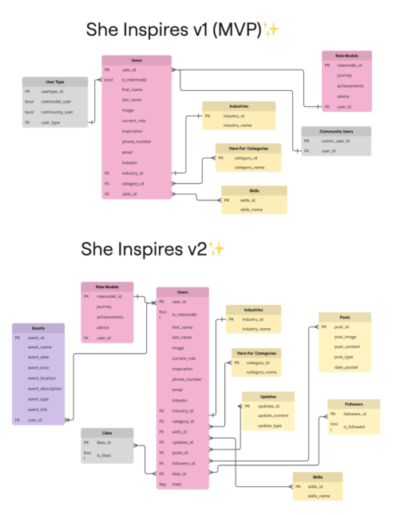

## Front-end Implementation

### Wireframes

#### Home Page
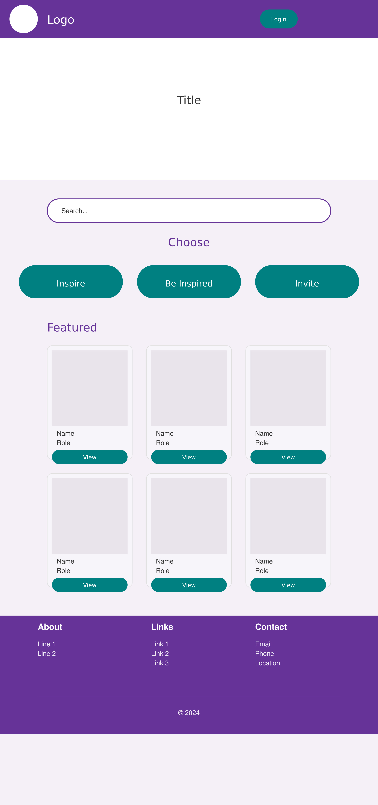

#### Home Page Mobile view
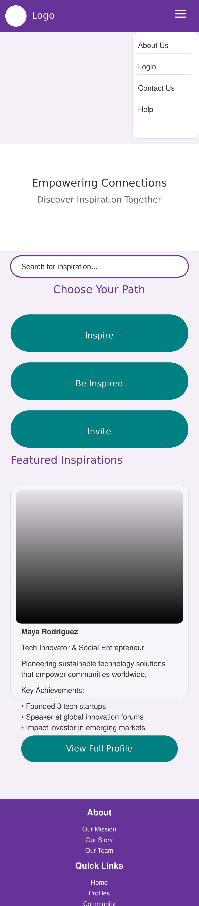

#### Role Model Profile
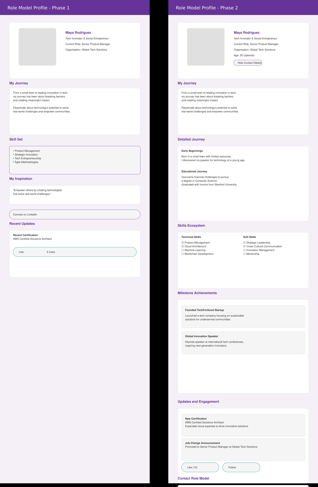

#### General User Profile
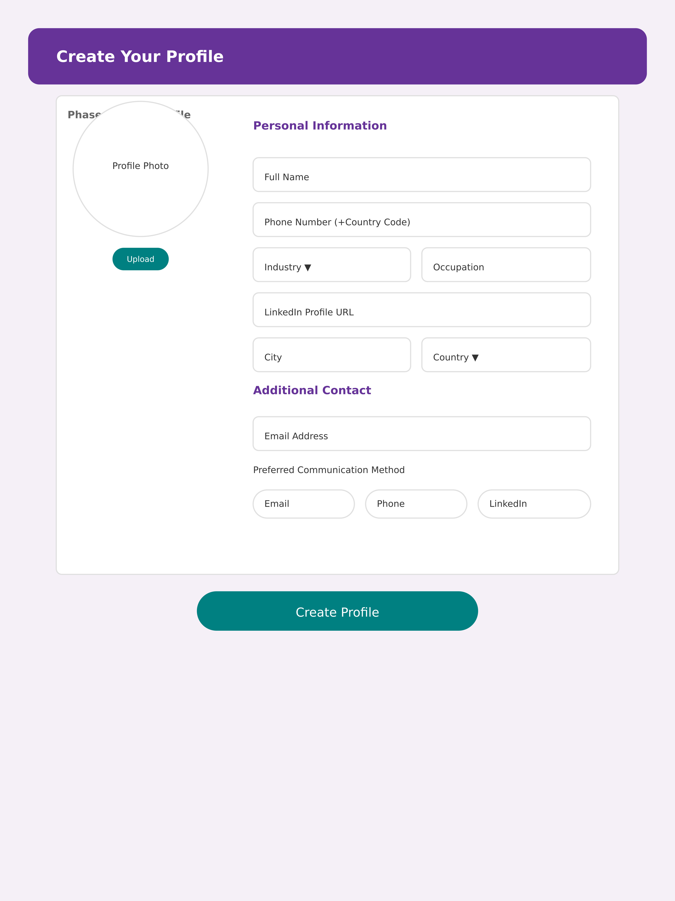

#### Invite Page
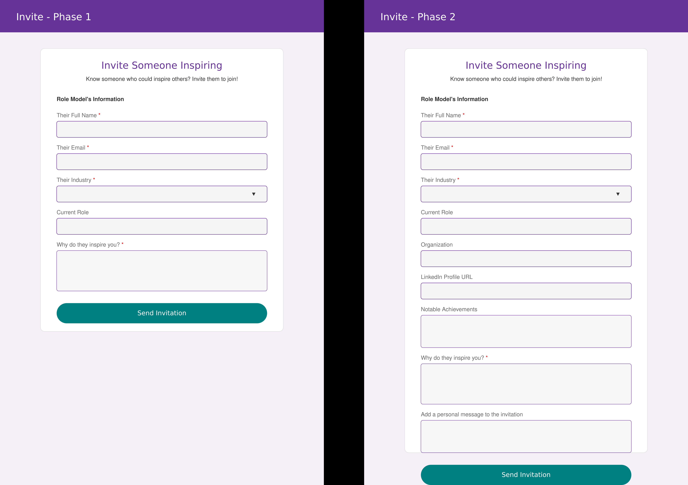

#### Login Page
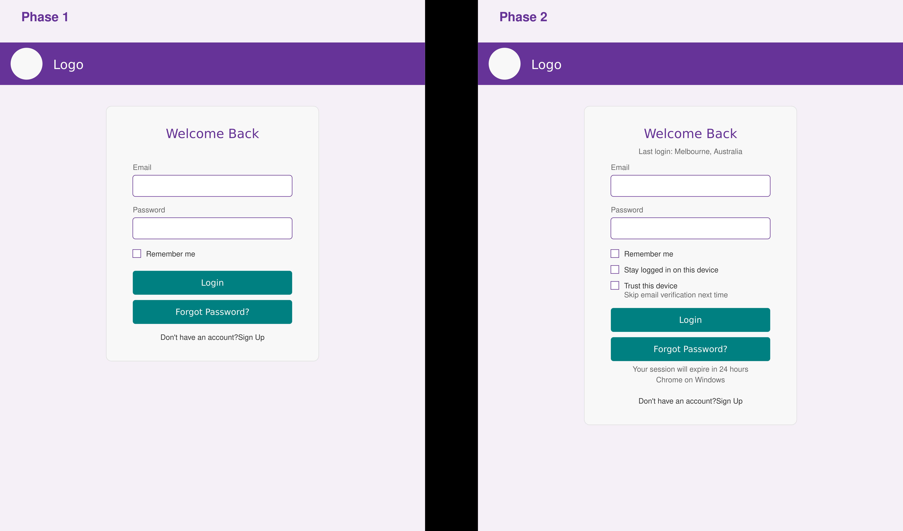

#### Signup Page
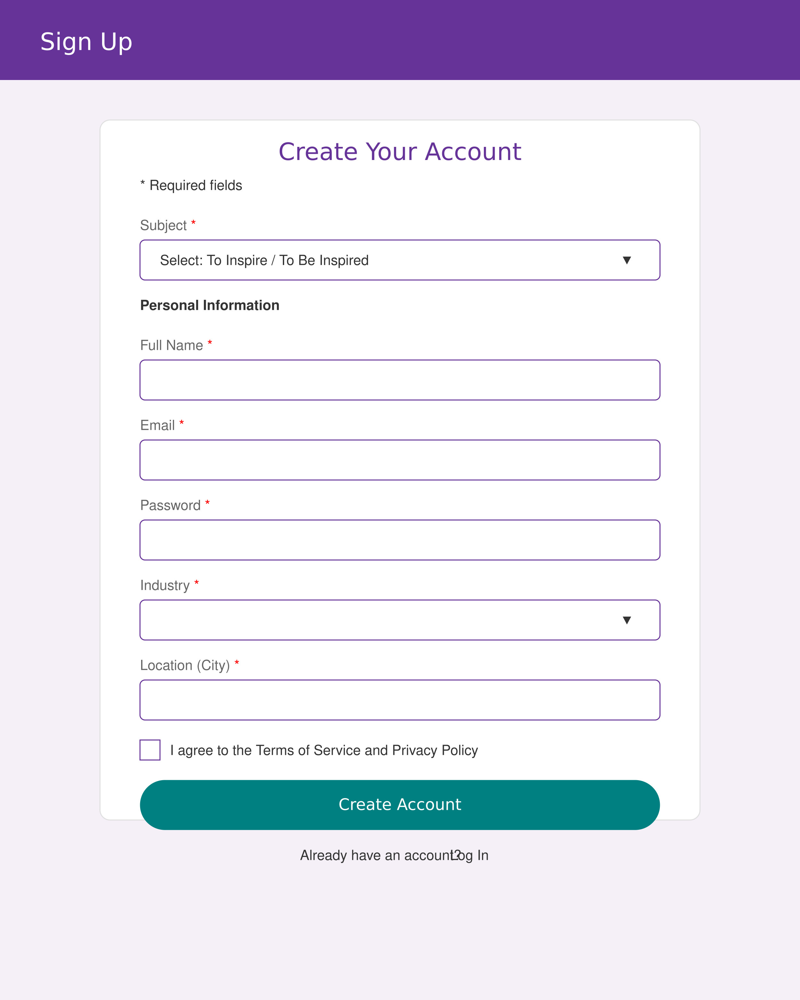

### Logo
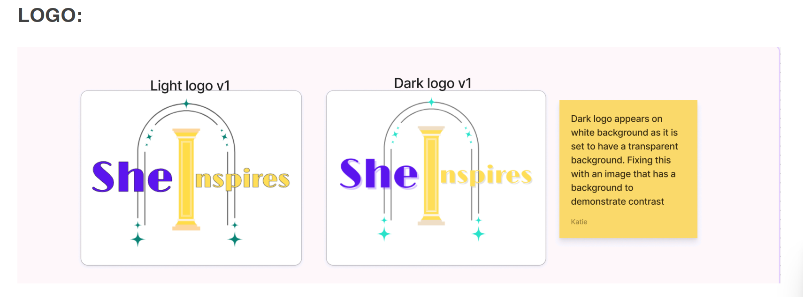

### Colours
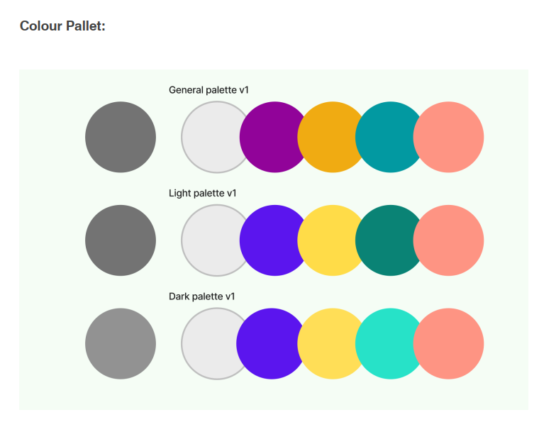

### Font

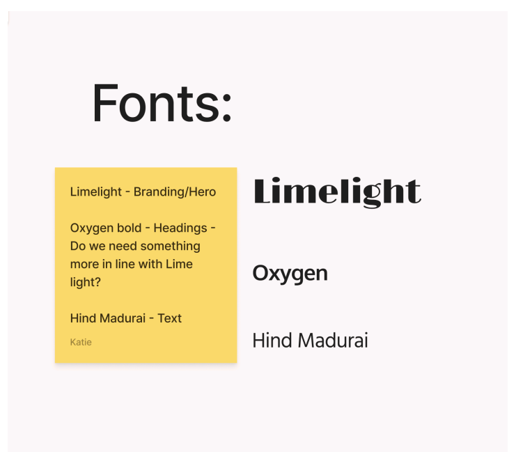

```css
@import url('https://fonts.googleapis.com/css2?family=Merriweather:ital,wght@0,300;0,400;0,700;0,900;1,300;1,400;1,700;1,900&family=Openans:ital,wght@0,300..800;1,300..800&display=swap');